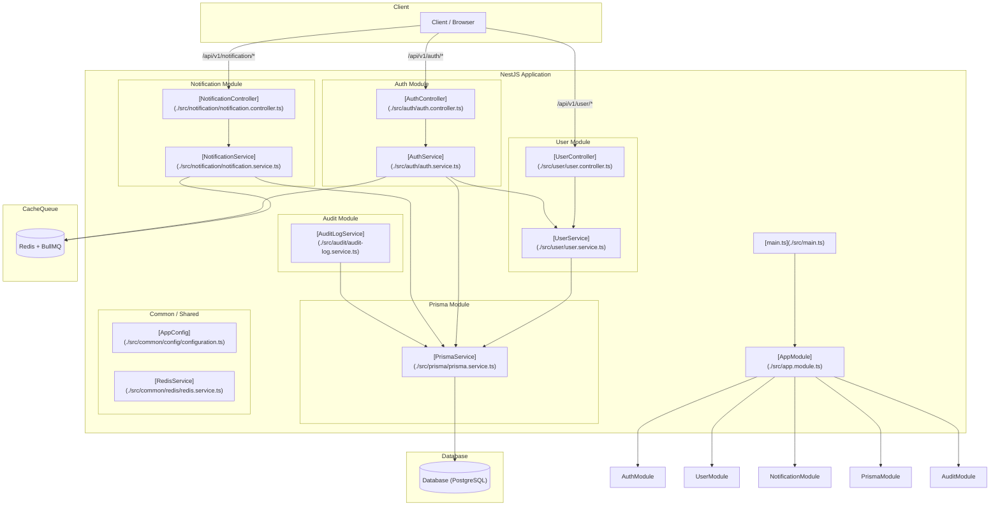

# NestJS Template

## Architecture

This project is built using [NestJS](https://nestjs.com/) and [Prisma ORM](https://www.prisma.io/). Below is a high-level overview of the application architecture, modules, and data flow.

### System Architecture Diagram

### Module Descriptions

1. **[AppModule](./src/app.module.ts)**: The root module of the application. It bootstraps the application and registers all core, feature, and global modules (e.g., config, exception filters, interceptors).
2. **[AuthModule](./src/auth/auth.module.ts)**: Handles authentication, signup, login, Google/Microsoft OAuth, session/jwt tokens, cookie setup, MFA, and route guards.
3. **[UserModule](./src/user/user.module.ts)**: Manages user creation, profiles, finding users, and updating user records.
4. **[NotificationModule](./src/notification/notification.module.ts)**: Handles in-app notifications (DB) + email delivery via BullMQ queue and `EmailChannel`.
5. **[AuditModule](./src/audit/audit.module.ts)**: Immutable audit logging for security events (e.g., `UNAUTHORIZED_ACCESS`).
6. **[PrismaModule](./src/prisma/prisma.module.ts)**: Manages connection pool and queries to the database using the Prisma Client.
7. **[Common](./src/common)**: Contains shared config validators, HTTP exception filters, helmet setups, Redis service, and global response interceptors.

### Core Data Models

The database schemas are defined modularly under:

- [account.prisma](./src/prisma/models/account.prisma)
- [user.prisma](./src/prisma/models/user.prisma)
- [notification.prisma](./src/prisma/models/notification.prisma)
- [notification_preference.prisma](./src/prisma/models/notification_preference.prisma)
- [audit_log.prisma](./src/prisma/models/audit_log.prisma)

## Project setup

For a comprehensive guide on setting up your local development environment (including Hybrid vs. Full Containerized modes, configuring local IP endpoints, and database migrations), please refer to the **[Developer Setup Guide](./docs/DEV_SETUP.md)**.
