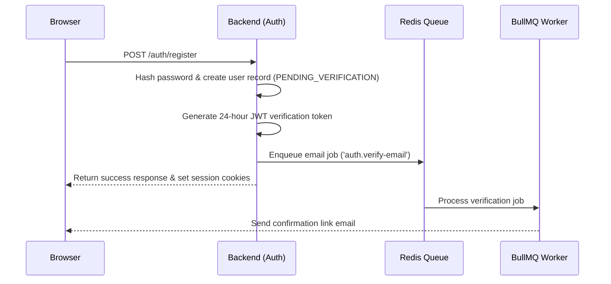
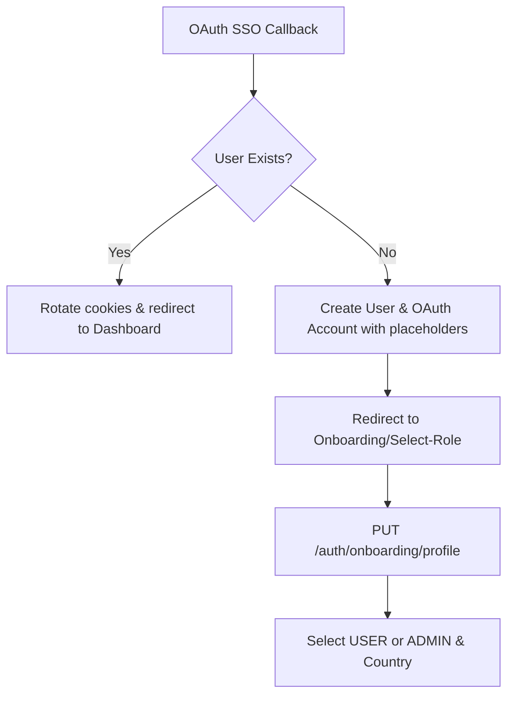

# Authentication & Onboarding Architecture 🔐

This document provides a comprehensive overview of the authentication system, session lifecycle management, and onboarding pipelines.

---

## 1. Overview
The NestJS Template implements a unified security posture consisting of:
* **Multiple Auth Providers**: Local credentials (argon2 hashing) and Social/Enterprise SSO via OAuth 2.0 (Google, Microsoft).
* **Two-Phase MFA Login**: Time-based One-Time Passwords (TOTP) backed by `otplib`.
* **Strict Default RBAC**: A closed-by-default permission guard preventing access unless endpoints are explicitly public or decorated with permissions.

---

## 2. Session Model & Storage
Authentication sessions are managed using rotated JWTs stored in secure, HTTP-only, same-site cookies:
1. **Access Token (`accessToken`)**: Short-lived JWT (default 1 hour) carrying user metadata (`sub`, `email`, `role`).
2. **Refresh Token (`refreshToken`)**: Long-lived JWT (rotates on use) stored in Redis.

### Session Lifecycle constraints
* **Concurrent Session Limits**: Users are limited to a maximum of **5 concurrent sessions** (tracked in Redis via `user-sessions:${userId}`). Logging in from a 6th device automatically revokes the oldest session.
* **Session Expiry**: Set to 30 days if "rememberMe" is toggled, otherwise defaults to 15 minutes.
* **Token Rotation**: Every refresh request revokes the old session key in Redis and issues a fresh token pair to mitigate replay attacks.

---

## 3. Registration & Onboarding Pipeline

### A. Local Credentials Signup
- **Authorized Roles**: `USER` and `ADMIN` are allowed to self-register via the portal. Other roles must be provisioned by administrators.
- **Verification**: Dispatching a registration request automatically queues a 24-hour verification link email using **BullMQ** background workers and sets the user status to `PENDING_VERIFICATION`.

### B. OAuth SSO Signups
- When a user logs in via Google or Microsoft for the first time, the backend automatically provisions a User and OAuth Account record.
- **Defaults**: Since OAuth profiles do not contain role and country details, the account is created with default placeholders (`role: USER`, `country: US`). `isEmailVerified` is flagged `true` immediately.
- **Onboarding Redirect**: The frontend detects a `PENDING_VERIFICATION` status or placeholder properties and redirects the user to the onboarding selector.

---

## 4. Multi-Factor Authentication (MFA)

### Two-Phase Login Flow
1. **Phase 1**: User submits credentials or authenticates via OAuth. If `user.isTwoFactorAuthenticationEnabled` is active, the server returns a 5-minute restricted `mfa_token` (MFA intent JWT) instead of the final access cookies.
2. **Phase 2**: The user enters their 6-digit authenticator code. The frontend sends `mfa_token` and `code` to `POST /auth/login/mfa`. The server validates the code and establishes the session cookies.

### Setup and Configuration
- **MFA Status**: Client can fetch `GET /auth/mfa/status` to determine if setup is complete.
- **Enablement**:
  1. Call `POST /auth/mfa/setup` to get the secret and QR-Code stream.
  2. Scan the QR code using Google Authenticator, Authy, or Microsoft Authenticator.
  3. Submit the token to `POST /auth/mfa/confirm` to verify and activate.
- **Disablement**: Users can disable MFA by sending their active 6-digit code to `PUT /auth/mfa`.

---

## 5. API Reference Summary

### Authentication Routes

| Endpoint | Method | Access | Description |
| :--- | :--- | :--- | :--- |
| `/auth/register` | `POST` | Public | Registers a new user |
| `/auth/login` | `POST` | Public | Credentials validation (Phase 1) |
| `/auth/login/mfa` | `POST` | Public | TOTP validation (Phase 2) |
| `/auth/google` | `GET` | Public | Redirects to Google consent screen |
| `/auth/microsoft` | `GET` | Public | Redirects to Microsoft consent screen |
| `/auth/refresh` | `POST` | Public | Session token rotation |
| `/auth/logout` | `POST` | Public | Clears cookies and revokes session |
| `/auth/verify-email` | `GET` | Public | Verifies email verification tokens |
| `/auth/verify-email/request`| `POST` | Auth | Resends verification link email |
| `/auth/password/reset-request`| `POST`| Public | Initiates password recovery |
| `/auth/password/reset-confirm`| `POST`| Public | Confirms password recovery |
| `/auth/me` | `GET` | Auth | Retrieves the current user profile |

### Onboarding & MFA Routes

| Endpoint | Method | Access | Description |
| :--- | :--- | :--- | :--- |
| `/auth/onboarding/profile` | `PUT` | Auth | Configures role and country settings |
| `/auth/mfa/setup` | `POST` | Auth | Generates secret and QR-code stream |
| `/auth/mfa/confirm` | `POST` | Auth | Verifies setup and enables MFA |
| `/auth/mfa/status` | `GET` | Auth | Checks if MFA is configured |
| `/auth/mfa` | `PUT` | Auth | Disables MFA for the user account |
