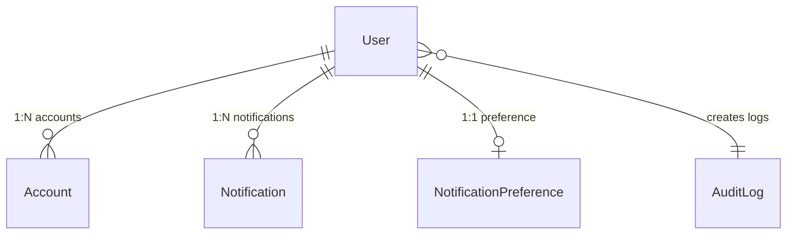

# Database Schema Documentation

This document describes the database schema architecture, models, and indexing strategies configured for the NestJS Template using Prisma.

## Entity Relationship Diagram

---

## Schema Architecture

- **Database Engine:** PostgreSQL
- **Key Strategy:** Time-sorted `UUIDv7` string strategy for all primary and foreign keys.
- **Organization:** Modular multi-file Prisma structure. All model schemas are located within the [src/prisma/models/](../src/prisma/models/) directory.

---

## 1. Authentication & Identity Models

### User
Tracks user profiles.
- **Enums:** 
  - `UserRole`: `USER`, `ADMIN`
  - `UserStatus`: `PENDING_VERIFICATION`, `ACTIVE`, `DEACTIVATED`
- **Relations:** 1:N with `Account`; 1:N with `Notification`; 1:1 with `NotificationPreference`.
- **Indexes:** 
  - Index on `[email]`
  - Composite index on `[role, status]`

### Account
Handles identity provider links and credentials mapping.
- **Relations:** N:1 with `User`.
- **Indexes:** Unique composite index on `[provider, providerAccountId]`.

---

## 2. Notifications

### Notification
In-app notification log, polled by the client and invalidated via Redis cache.
- **Enums:**
  - `NotificationPriority`: `STANDARD`, `HIGH`, `URGENT`
- **Relations:** N:1 with `User`.
- **Indexes:**
  - Composite index on `[userId, isRead]`
  - Index on `[createdAt]`

### NotificationPreference
Per-user channel preferences (email / in-app / both).
- **Relations:** 1:1 with `User`.
- **Enums:**
  - `NotificationChannelPreference`: `EMAIL`, `IN_APP`, `BOTH`

---

## 3. System Audit Logs

### AuditLog
Immutable database log tracking user actions and IP signatures.
- **Primary Key:** `UUIDv7`.
- **Indexes:**
  - Composite index on `[timestamp, eventType]`
  - Composite index on `[userId, timestamp]`
