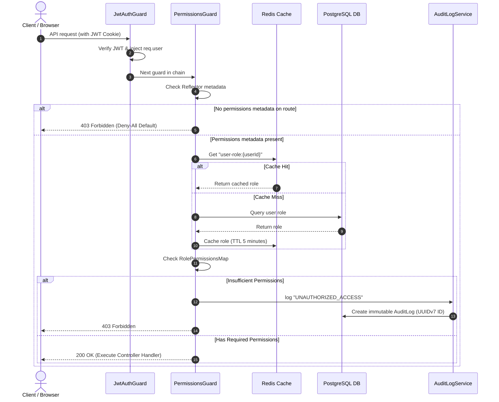

# Role-Based Access Control (RBAC) & Permissions Documentation

This document describes the design, implementation, and usage of the Role-Based Access Control (RBAC) matrix in the NestJS Template.

---

## 1. Architectural Overview

The NestJS Template implements a strict **Fail-Secure Default (Deny-All)** permissions architecture. Every API endpoint must be explicitly secured with required permissions, or the system will reject execution by default.

### Enforcement Flow



---

## 2. Key Components

### A. Permissions Mapping Configuration
Authoritative roles mapping is defined in [src/common/permissions.ts](../src/common/permissions.ts).
It maps `USER` and `ADMIN` roles to a list of allowed `Permission` values.

### B. Custom Decorator
Controller endpoints are secured using the `@RequirePermissions(...permissions)` decorator defined in [src/auth/decorators/permissions.decorator.ts](../src/auth/decorators/permissions.decorator.ts).

```typescript
import { RequirePermissions } from './decorators/permissions.decorator';
import { Permission } from '../../common/permissions';

@Post()
@RequirePermissions(Permission.MANAGE_USERS)
async createUser() {
  return this.userService.create();
}
```

### C. Permissions Guard
The central guard [src/auth/guards/permissions.guard.ts](../src/auth/guards/permissions.guard.ts) executes sequentially after `JwtAuthGuard`.
- Queries the Redis cache using key format `user-role:${userId}`.
- Caches roles with a **5-minute TTL (300 seconds)**.
- Logs unauthorized breaches to the database.

### D. Audit Logger Service
Breaches trigger the `AuditLogService` located in [src/audit/audit-log.service.ts](../src/audit/audit-log.service.ts), creating an immutable entry under the event type `UNAUTHORIZED_ACCESS`. The service handles UUIDv7 generation for matching correlation tracking.

### E. Cache Invalidation
Whenever a user's role is updated or deleted via [src/user/user.service.ts](../src/user/user.service.ts), the corresponding Redis cache key is invalidated immediately:
```typescript
await this.redisService.del(`user-role:${userId}`);
```
